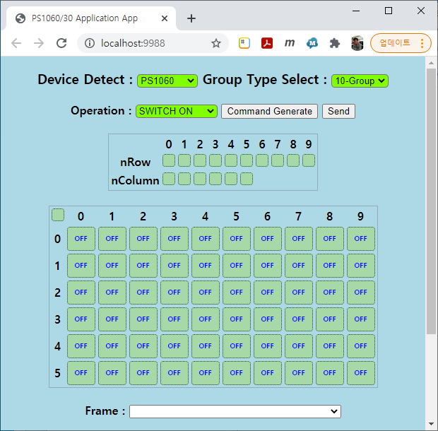

# PS1xxx Demo 앱

App for PS1030/60 Application Board

## 사용방법

### UART Interface(COM 포트)를 이용하는 방법.

1. Application Board의 전원을 인가하고, USB Cable을 PC와 연결한다.
   + USB Driver는 설치되어 있어야만, PC의 COM 포트가 연결될 수 있다.(`장치관리자`에서 `포트` 항목에서 확인할 수 있다.)
   
2. `app.exe`를 실행한다.
   + `Windows Defender`에서 network 보안 때문에 경고 창이 발생할 수 있다. `액세스 허용(A)` 버튼을 클릭해야 한다.
   
   + 브라우저(크롬, IE, 사파리, ...)가 실행되면서 `http://localhost/9988`에 접속한다.
   
   + COM 포트 연결과 Device 및 Group Type 선택을 설정할 필요가 없다. 자동 검색되어 실행된다.
   Device와 Group Type등이 정상적으로 보여지지 않는다면 PC의 COM 포트 연결에 문제가 있으므로, `장치관리자`에서 다시 확인해 보아야 한다.
3. 기본 동작은 아래와 같이 순차적으로 실행한다.
   
   + Switch[0,1,2]를 클릭해서 선택한다.(Switch는 Toggel방식으로 선택과 해제할 수 있다.)
   + `Operation`항목에서 `SWITCH ON` 명령을 선택한다.
   + `Command Generate`버튼을 클릭하면, `Frame`창에 Bytes Command가 생성된다.
   + `Send` 버튼을 클릭해서 Application Board로 Bytes Command를 전송한다.
   + Application Board의 MCU는 Bytes Command를 PS1060으로 전송하여 Switch를 제어한다.
   
6. Group 설정 및 동작 검토.
   + `Group Type Select`항목에서 Group을 선택하면 선택된 Group 정보가 PS1060(30)으로 전송된다.
   GUI에서도 Group 정보에 따라서 `Row`, `Column`의 구성이 자동으로 변경된다.
   PS1060에 대해서 `4-Group`으로 변경한 경우의 아래와 같이 `Row/Column`이 구성된다.
   
   PS1060에 대해서 `16-Group`으로 변경한 경우의 아래와 같이 `Row/Column`이 구성된다.
   

   + `10-Group`으로 설정하고, `nRow`의 `0`와 `9`를 선택하고, `Operation`에서 `SWITCH ON`을 선택하고, `Command Generate` 버튼을 클릭하면 아래와 같이 `Frame` 창에 Bytes Command가 생성된다.
   

   + `Send` 버튼을 클릭하여 Switch의 동작 결과를 확인 해 보자.
   

### 무선(WiFi) 접속을 사용하는 방법.

`PS1060(30) Application Board`에서 아래와 같이 Jumper(J19) 설정을 변경해야 한다.


보드에 전원을 인가하고, `Reset` 버튼을 클릭한다.
LCD 화면에 `[ PS1060 Test ]`라고 출력되어야 한다.

무선(WiFi) 접속을 위해서는 PC에서도 무선(WiFi)이 지원해야 한다. 만약 PC에 무선(WiFi)가 없다면, 간단히 핸드폰을 사용해서 동작을 확인할 수 있다.

`PS1060(30) Application Board`의 무선(WiFi)는 AP와 Station 모드로 함께 동작하고 있기 때문에 각각의 모드로 접속해서 사용할 수 있다.

#### AP(Access Point) 모드에 접속하는 방법.

핸드폰의 `WiFi 설정`에서 `APOLLO`라는 네트워크와 연결하자.(암호는 `12345678`을 입력한다.)


```
"인터넷에 연결되어 있지 않음" 이라고 표시되는 것은 정상이다.
```

핸드폰의 브라우저(크롬)을 실행하고, `주소창(URL)`에 아래와 같이 `192.168.5.1`을 입력하고 연결(`이동` 버튼 클릭)한다.


아래와 같이 연결된 화면을 볼수 있다.


GUI(화면) 사용방법은 앞에서 설명한 내용을 참조하여 실행할 수 있다.


#### Station 모드에 접속하는 방법.

`Station` 모드로 접속하기 위해서는 먼저 `PS1060(30) Application Board`가 공유기(AP)에 접속해야만 한다.

PC(핸드폰)이 연결된 공유기(AP)에 접속하기 위해서는 SSID와 password를 `PS1060(30) Application Board`에 입력해야 한다.

[Serial Terminal Program](https://sites.google.com/site/terminalbpp/Terminal20141030.zip?attredirects=0&d=1)을 받아서 압축을 해제하고 실행하자.

아래 그림과 같이 `COM` 포트와 `Baud rate`을 설정하고, `Connect` 버튼을 클릭하여 Serial 통신을 연결한다.

화면 하단에 `ssid:공유기SSID,pass:암호`를 입력하고, `Send` 버튼을 클릭한다.


`PS1060(30) Application Board`를 Reset해 준다.

보드의 LCD 화면에 아래와 같이 IP가 출력된다면 정상적으로 공유기(AP)에 연결된 것이다.


PC(핸드폰)에서 브라우저(크롬)를 실행하고, 주소창(URL)에 IP를 입력하고 접속해 보자.


GUI(화면) 사용방법은 앞에서 설명한 내용을 참조하여 실행할 수 있다.
